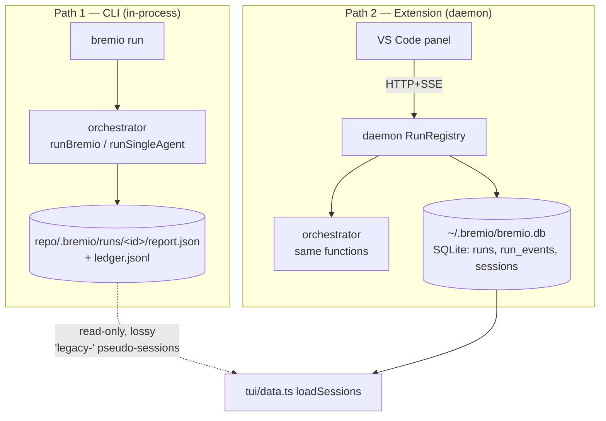
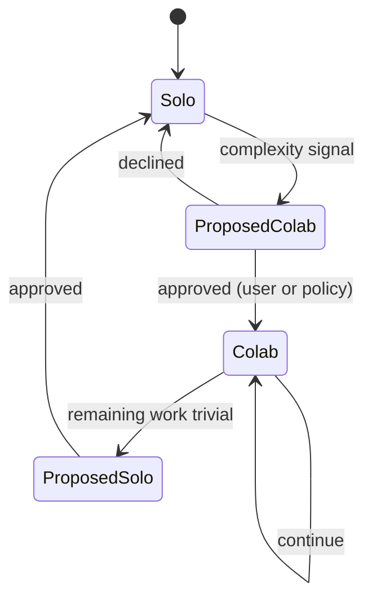

# 14 — Architecture review and implementation plan

**Status:** proposal. No code was changed to produce this document.
**Reviewed at:** `main` @ `16d145a` (v1.2.0), 544 tests / 58 files green.
**Scope:** the dogfood follow-up requirements (§2.1–2.16 of the brief).

---

## A. Current-state architecture map

### A.1 Packages

| Package | LOC | Role |
|---|---:|---|
| `apps/cli` | 4566 | Command parsing, TUI (Ink), **and in-process run execution** |
| `packages/orchestrator` | 3834 | Plan → assign → execute → verify → aggregate; ledger; router; calibration |
| `apps/daemon` | 2626 | HTTP + SSE server, SQLite store, run registry, process lifecycle |
| `apps/vscode-extension` | 2372 | Panel webview + host; **zero runtime `@bremio/*` deps by design** |
| `packages/quota` | 974 | Reads AI-Quota-Tray's DB |
| `packages/adapter-sdk` | 900 | `AgentAdapter` contract, capabilities, `ProcessSupervisor` |
| `packages/harness` | 552 | Turn runner, context assembler, context budget (v1.1) |
| `packages/protocol` | 453 | Wire shapes, `PROTOCOL_VERSION`, event schemas |
| `packages/adapter-*` | ~2200 | claude, codex, antigravity, opencode, local |
| `packages/event-view` | 304 | Canonical `renderEvent`, `extractResponse`, lane assembly |
| `packages/workspace` | 434 | Git worktree isolation |

### A.2 The two execution paths (this is the root of most gaps)

**Evidence:**

- `apps/cli/src/index.ts:610,631,668,706` call `runSingleAgent` / `runBremio` **directly**. The CLI touches the daemon only at `index.ts:944` (`reportDaemonStatus`) and for `daemon start/stop`.
- `packages/orchestrator/src/run.ts:107,253,332` write `report.json` under `<repo>/.bremio/runs/<runId>/`.
- `grep RunStore|sqlite packages/orchestrator/src/` → **0 hits**. The orchestrator never writes to the daemon's database.
- `apps/cli/src/tui/data.ts` `loadSessions()` tries daemon `/sessions` → falls back to `RunStore` → falls back to `listReports()`, mapping filesystem reports into **fabricated** sessions: `id: "legacy-" + runId`, `turnCount: 1`, `createdAt: new Date().toISOString()`.

So a CLI run and a panel run produce **different records in different stores with different identity**. The panel cannot see a CLI run at all; the TUI sees it only as a synthetic single-turn "legacy" entry with an invented timestamp.

### A.3 Session lifecycle

- `apps/daemon/src/storage.ts:685` — `sessions(id, repository_path, title, created_at, updated_at)`. **No configuration columns.**
- `runs` **does** carry `mode`, `lead_provider`, `worker_providers`, `session_id`, `turn_index` (PRAGMA-verified).
- `storage.ts:535` `sessionDetail()` projects turns as `{turnIndex, runId, prompt, status, model?, reasoningLevel?}` — where `model` is scraped from **the last `usage` event**, i.e. the provider-*confirmed* model, not the requested agent.

### A.4 Approval lifecycle

There isn't one. The only approval in the codebase is Single→Team escalation (`orchestrator/src/single-run.ts:285–315`).

Per-action permission is a **two-value enum** (`adapter-sdk/src/capabilities.ts:39`): `read-only | workspace-write`, mapped per adapter:

| Adapter | `read-only` | `workspace-write` |
|---|---|---|
| claude | `canUseTool` denies `WRITE_TOOLS` (`claude-adapter.ts:104`) | `canUseTool` returns `allow` unconditionally |
| codex | `--sandbox read-only` | `--sandbox workspace-write` |
| antigravity | `--mode plan` | **`--dangerously-skip-permissions`** (`antigravity-adapter.ts:101`) |
| opencode | `plan` agent profile | `build` agent profile |

### A.5 Event flow

`AgentEvent` (started / message / thinking / tool_use / tool_result / usage / log / error / completed) → daemon persists via `#emit` (`runs.ts`, store-then-publish) → SSE with `afterSeq` resume → panel. `renderEvent` is canonical in `event-view` and **copied** into `webview.ts` (drift-tested) so the VSIX ships no runtime deps.

---

## B. Gap analysis

| # | Area | Current behaviour | Desired | Root cause (evidence) | Risk |
|---|---|---|---|---|---|
| 1 | **Tool ownership** | Bremio spawns provider CLIs and *observes* `tool_use` events. It owns no tool loop. `grep spawn(` → only `adapter-*/src/*cli.ts` | Bremio mediates tool calls | Architecture: Bremio is an *orchestrator of agents*, not an *agent runtime* | **Blocks 2.3, 2.12, 2.13, 2.14, 2.15 as specified.** Highest-order constraint |
| 2 | **Agent edits before approval** | No approval gate exists at any layer; antigravity write path passes `--dangerously-skip-permissions` | Per-action approval enforced in core | `antigravity-adapter.ts:101`; no `approval` concept outside escalation | **P0 safety.** Unreviewed writes to a real repo |
| 3 | **Resume uses wrong provider** | `primaryAgent = latestTurn?.model?.split("/")[0] ?? "claude"` (`session.ts:309`) | Restore the session's persisted config | Provider identity is **reverse-engineered from a provider-reported model string**, with a hardcoded `"claude"` fallback | **P0 correctness.** Exactly the reported Antigravity→Claude bug |
| 4 | **Resume loses mode** | `detail.mode` is read but `SessionDetail` has no `mode` field → always `undefined` → `"single"` (`session.ts:308`) | Co-lab session resumes as Co-lab | `storage.ts:564` never projects `runs.mode` | **P0.** Silent Co-lab→Solo downgrade |
| 5 | **CLI/extension split-brain** | Two stores, two identities (§A.2) | One source of truth | CLI executes in-process; daemon is a *parallel* client of the same orchestrator | **P1.** Every "sync" feature is unbuildable until fixed |
| 6 | **Change visibility** | `filesChanged` = git snapshot diff per run (`single-run.ts:220`); files *read* never tracked | Per-turn/task/agent read+write attribution, reviewable diff | Whole-run git delta cannot attribute, and cannot separate user edits from agent edits | **P1.** Cannot tell what Bremio did |
| 7 | **Attachments** | Paths appended as prompt text (`extension.ts:396`); never persisted | Typed, persisted, removable context items | No attachment model anywhere (`grep attachment apps/daemon packages/orchestrator` → 0) | P2. Blocks 2.6/2.7 |
| 8 | **Context window UI** | `enforceContextBudget` exists (harness) but no surface shows usage; `grep contextWindow` → 0 | Live usage %, compact button | Budget is enforcement-only, never reported outward | P2 |
| 9 | **Memory** | `grep memory` → **0 hits** | Layered memory with lifecycle | Not started | P3 |
| 10 | **MCP / web search / skills** | `grep mcp\|web_search\|skill` → **0 hits** | Extensible tools | Not started + blocked by #1 | P3 |
| 11 | **Hooks** | 50 hits are in-process orchestrator callbacks (`run.ts:141` `opts.hooks?.onLeadStart`) — observation only, cannot mutate | User-extensible, can veto | Present as a telemetry seam, not an extension point | P3 |
| 12 | **Mode naming** | `"single" \| "team"` is a **persisted enum** in `runs.mode`, the daemon Zod schema, ledger entries, and report JSON | Solo / Co-lab | Value is load-bearing, not a label | P2, needs migration |
| 13 | **Panel layout** | Fixed `min-height: 76px` composer; no resize affordance | User-resizable | Never implemented | P3 |
| 14 | **ADHD** | `grep -rni adhd .` → **0 hits repo-wide** | — | Undefined | Open question — see §H |

---

## C. Architectural decisions

### ADR-1 — Bremio becomes a mediating runtime, not just an orchestrator

**This is the decision the other nine depend on.**

Today Bremio hands a prompt to `claude`/`codex`/`agy`/`opencode` and watches events stream back. The provider owns the tool loop, the sandbox, and the permission prompt.

Every requested control feature (approve mode, plan mode, shell tool, web search, MCP, hooks) assumes **Bremio decides whether a tool call happens**. It currently cannot.

**Options:**

| | Approach | Pros | Cons |
|---|---|---|---|
| **A** | **Capability-gated mediation.** Add `interactiveApproval` capability. Adapters that expose an interception seam (Claude's `canUseTool`) get real per-action approval; others degrade to the coarsest honest gate (`read-only` for Plan mode) and **declare** the degradation | Truthful; no rewrite; works with today's adapters; consistent with the existing "capabilities gate roles, never provider names" rule | Approve mode is not uniform across providers — must be surfaced, not hidden |
| B | Own the agent loop (Bremio calls model APIs, runs its own tools) | Uniform control, full MCP/hook/websearch story | Rewrites the product; abandons subscription-quota routing (the reason adapters wrap CLIs); enormous |
| C | Prompt-only ("do not modify files") | Trivial | **Explicitly forbidden by the brief, and correctly so** — not enforcement |

**Recommendation: A**, with B as a possible future for a first-party provider.

**Consequence to accept up front:** *Plan mode is enforceable everywhere* (it maps to `read-only`, which every adapter already honours at the sandbox level). *Approve mode is only fully enforceable where the adapter offers interception* — today that is Claude. Antigravity currently receives `--dangerously-skip-permissions` on the write path, so it must either be denied Approve mode or have that flag removed.

**Trade-off:** we surface an uncomfortable truth (uneven control) instead of a comfortable lie (a mode that silently doesn't apply). This matches `docs/10` §7.

**Unresolved:** does `agy` have a non-skip permission mode? Needs a probe task (M2-T0).

---

### ADR-2 — The daemon becomes the single source of truth; the CLI becomes a client

**Chosen:** CLI routes run execution through the daemon (auto-starting it as the extension already does), so both surfaces share `bremio.db`.

**Alternatives:** (a) shared SQLite written by both processes directly — rejected: concurrent writers, no live event fan-out, and the single-instance lock exists precisely to keep one writer; (b) keep both and sync — rejected: two identities can never be reconciled after the fact (`legacy-` ids prove it).

**Trade-offs:** `bremio run` gains a daemon dependency and a startup cost; an offline/CI path must remain. Mitigation: keep `--no-daemon` for one-shot use, documented as *not* recorded in shared history.

**Migration:** existing `.bremio/runs/*/report.json` are **imported**, not deleted (`docs/10`: run artifacts are never rewritten). Import is additive and idempotent.

---

### ADR-3 — Sessions persist a configuration snapshot; resume restores it

**Chosen:** new `session_config` (or columns on `sessions`) holding the **requested** configuration: mode, lead agent id, worker agent id, model, reasoning level, approval mode, permission, cwd, base branch, tool/MCP enablement, plus a `config_version`.

Principle, verbatim from the brief: **resume must restore the session, not recreate it from current defaults.**

Distinguish two things the code currently conflates:
- **Session configuration** — what the user chose. Persisted, immutable except by explicit user change (which appends a new revision).
- **Runtime configuration** — what the provider actually confirmed (model string, reasoning). Recorded per turn, **never** used to reconstruct identity.

**Trade-off:** a session pinned to an unavailable provider must fail loudly with a named remedy, not silently fall back — the fallback *is* the bug.

---

### ADR-4 — Approval is a core-owned state machine, not adapter behaviour

`ApprovalRequest{id, sessionId, runId, action, target, risk, state, requestedAt, decidedAt, decidedBy}` with `pending → approved | rejected | expired | cancelled`, persisted, exposed over the protocol, and surfaced identically in CLI and panel.

The adapter's interception seam **calls into** this engine; it does not implement policy. Policy (mode → allowed action classes) lives in one place and is unit-testable without any provider.

**Trade-off:** an interactive gate inside a non-interactive CLI run needs a decision — default to **fail-closed** (deny + explain) rather than block forever.

---

### ADR-5 — Solo/Co-lab is an explicit state machine with recorded transitions

Transitions are **events in session history** with a reason, mirroring how auto-mode already records its reason (`runs.ts` `#emit(... "auto: ...")`). Add hysteresis (minimum turns in a mode) to prevent oscillation. Escalation reuses the existing approved `resolveEscalationApproval` shape.

---

### ADR-6 — Rename via a persisted-value migration, not a label swap

`"single" | "team"` appears in `runs.mode`, the daemon's `StartRunSchema`, ledger entries, report JSON, and reports on disk. Chosen: **domain becomes `solo` | `colab`**; readers accept the old values forever (alias at parse); writers emit the new ones; a schema migration rewrites `runs.mode`; report JSON on disk is **read-compatible and never rewritten**.

---

### ADR-7 — Context items are typed, persisted, addressable

`ContextItem{id, sessionId, type: file|folder|selection|image|url|terminal|diff|note, source, addedAt, scope: message|turn|session, tokensEstimated, enabled}`. Replaces "append a path to the prompt string". Adapters receive a resolved bundle; providers without `vision` get a named degradation for images, never a silent drop.

---

### ADR-8 — Compaction produces an auditable artifact

Compaction writes a `summary` **plus** the ids of what it replaced, so a compacted turn can still say what it stood for. Never compacts: session config, pending approvals, task/ownership state, the current turn. Reuses the harness's existing `estimateTokens`/`enforceContextBudget` and its honest `estimated | measured` labelling.

---

### ADR-9 — Change tracking is git-derived plus event-derived, and says which

Git gives ground truth for *what changed*; events give *who/when*. Track both and label the source. A user edit made during a run must be distinguishable — snapshot dirty state at turn start, and never present an unattributable change as the agent's.

---

### ADR-10 — Protocol versioning is already sound; extend it

`PROTOCOL_VERSION = 2`, `MINIMUM_CLIENT_PROTOCOL = 1`, `/meta` capability handshake. New routes stay **additive** (no bump); bump only when a client cannot function without a new field. Add feature flags to `/meta.capabilities` (`approvals`, `contextItems`, `sessionConfig`) so surfaces degrade honestly instead of erroring.

---

## D. Milestone plan

| Milestone | Theme | Gate |
|---|---|---|
| **M0** | Truth & safety foundations | Session config persists+restores; approval engine exists and is enforced where interception exists; Plan mode provably cannot write |
| **M1** | One source of truth | A CLI run is visible in the panel and vice versa, same id, live |
| **M2** | Control & transparency | Plan/Approve/Autopilot end-to-end; change review UI |
| **M3** | Session & context UX | Mid-session context, images, context window, compact, panel resize |
| **M4** | Solo/Co-lab orchestration | Rename migrated; transitions persisted and approved |
| **M5** | Tools & integrations | Command tool, web search, MCP, plugins/skills, hooks |
| **M6** | Memory | Layered memory with review lifecycle |

M0 and M1 are prerequisites for essentially everything else. M5 depends on ADR-1's outcome.

---

## E. Task breakdown

> Sized S (≤½ day) / M (~1 day) / L (2–3 days) / XL (split further before starting).

### M0 — Truth & safety foundations

#### M0-T1 — Persist a session configuration snapshot

**Goal** Every session records the configuration it was created with.
**Problem** `sessions` has no config columns (`storage.ts:685`), so resume has nothing to restore.
**Scope** Schema v4: `session_config` keyed by `(session_id, revision)` holding mode, lead/worker agent id, model, reasoning, permission, approval mode, cwd, base branch. Write on session creation. Read API. Transactional idempotent migration following the v1→v2 pattern already in `storage.ts`.
**Out of scope** Using it on resume (M0-T2). UI. Tools/MCP fields (add columns, leave unset).
**Files** `apps/daemon/src/storage.ts`, `storage.test.ts`, `apps/daemon/src/runs.ts`.
**Dependencies** none.
**Design decisions** revision table vs columns (recommend revisions — supports "user changed provider mid-session" without losing history).
**Steps** 1) schema + migration 2) `createRun` writes config when it creates a session 3) `getSessionConfig` 4) migration test from a v3 DB.
**Acceptance** ☐ v3 DB migrates without loss ☐ interrupted migration leaves DB usable (transactional) ☐ config round-trips ☐ existing sessions get a config row derived from `runs.lead_provider`/`runs.mode`.
**Tests** Unit: config round-trip, revisions. Migration: v3 fixture → v4, and re-running is a no-op. Regression: full suite.
**Risks** Schema migration on real user data — mitigated by the transactional pattern already proven.
**Size** M

#### M0-T2 — Resume restores the session instead of guessing

**Goal** Kill the Antigravity→Claude bug.
**Problem** `session.ts:309` derives the agent from a provider-reported model string with a `"claude"` fallback; `session.ts:308` reads a `mode` that `SessionDetail` never provides.
**Scope** `SessionDetail` gains `config`. `continueSessionCommand` uses it. Missing config → derive from `runs.lead_provider`/`runs.mode` (both exist). Unavailable provider → **fail with a named reason**, never fall back.
**Out of scope** Changing config mid-session (M4-T3).
**Files** `apps/cli/src/session.ts`, `apps/daemon/src/storage.ts`, `session.test.ts`.
**Dependencies** M0-T1.
**Acceptance** ☐ Antigravity Solo session resumes on Antigravity ☐ Co-lab session resumes as Co-lab ☐ unavailable provider errors with a remedy ☐ **no code path can select an agent from a model string**.
**Tests** Unit: resume with each provider. Integration: create-then-continue per provider. Regression: red-check by restoring the model-string derivation — must fail.
**Risks** Low. **Size** M — **highest-value task in the plan.**

#### M0-T3 — Permission policy engine (core, no UI)

**Goal** One place that answers "may this action happen?"
**Problem** Policy is smeared across four adapters with contradictory semantics (§A.4).
**Scope** New `packages/policy`: `ExecutionMode = plan | approve | autopilot`, `ActionClass` (read/write/create/delete/command/network/mcp/git-destructive/outside-workspace), a mode→class matrix, deny rules, and a pure `evaluate(action, mode, policy)`. No adapter changes yet.
**Out of scope** Enforcement wiring (M0-T4), UI, persistence of decisions (M2-T1).
**Files** new `packages/policy/`.
**Design decisions** deny-by-default vs allow-by-default per mode (recommend deny-by-default for `plan`/`approve`).
**Acceptance** ☐ Plan mode denies every write/command/network class ☐ matrix is data, not branches ☐ 100% branch coverage on `evaluate`.
**Tests** Unit table-driven over the full matrix.
**Size** M

#### M0-T4 — Enforce Plan mode at the adapter boundary

**Goal** Plan mode provably cannot write — enforcement, not prompting.
**Problem** ADR-1: providers own the tool loop.
**Scope** Map `plan` → the strongest honest gate each adapter has (`read-only` sandbox / `--mode plan` / plan profile / `canUseTool` deny). Add capability `interactiveApproval`. **Remove `--dangerously-skip-permissions` from the antigravity write path** or gate it behind `autopilot` only.
**Out of scope** Approve mode's interactive round-trip (M2-T1).
**Files** `packages/adapter-*/src/*-adapter.ts`, `packages/adapter-sdk/src/capabilities.ts`.
**Dependencies** M0-T3.
**Acceptance** ☐ Plan mode run cannot modify the workspace — asserted by a test that runs a real write attempt and checks git status ☐ each adapter declares `interactiveApproval` truthfully ☐ no provider named in policy code.
**Tests** Integration per adapter (skipped when the binary is absent, following existing convention). Red-check: remove the gate → test fails.
**Risks** `agy` may have no honest middle ground — see M2-T0.
**Size** L

### M1 — One source of truth

#### M1-T1 — Route CLI runs through the daemon

**Goal** One store, one identity.
**Scope** `bremio run` auto-starts/connects the daemon and calls `POST /runs`, streaming SSE for display. Keep `--no-daemon` for CI, documented as not shared.
**Out of scope** Importing old reports (M1-T2).
**Files** `apps/cli/src/index.ts`, `apps/vscode-extension/src/client.ts` (extract a shared client?), `apps/daemon/src/server.ts`.
**Dependencies** M0-T1.
**Design decisions** **Does the CLI get a shared client package, or does it use the daemon package directly?** The extension deliberately has zero `@bremio/*` runtime deps, so a shared client cannot be forced on it — the CLI may use one the extension inlines.
**Acceptance** ☐ `bremio run` appears in the panel live ☐ same run id in both ☐ Ctrl-C cancels via the daemon and the panel sees `cancelling` ☐ `--no-daemon` still works.
**Tests** Integration: CLI-started run observed over SSE. E2E: run in CLI, open panel, see it.
**Risks** Regression in the most-used path; cancellation semantics must keep `ProcessSupervisor` intact.
**Size** L

#### M1-T2 — Import filesystem reports into the store

**Goal** No history loss at the cutover.
**Scope** Idempotent importer: `.bremio/runs/*/report.json` → real sessions/runs. Never deletes or rewrites artifacts. Removes the `legacy-` pseudo-session path.
**Files** `apps/daemon/src/storage.ts`, `apps/cli/src/tui/data.ts`.
**Dependencies** M1-T1.
**Acceptance** ☐ import is idempotent ☐ artifacts untouched on disk ☐ imported runs are indistinguishable from native ones in the UI.
**Size** M

#### M1-T3 — Multi-client consistency

**Goal** Two panels + a CLI see the same thing.
**Scope** Verify/patch SSE fan-out for N subscribers, `afterSeq` replay after daemon restart, and a `sessionUpdated` broadcast so a second client refreshes.
**Dependencies** M1-T1.
**Acceptance** ☐ two clients on one run receive identical event sequences ☐ a client connecting mid-run replays correctly ☐ daemon restart mid-run leaves both clients recoverable.
**Size** M

### M2 — Control & transparency

- **M2-T0 — Probe provider approval surfaces** (S). Read-only investigation per `docs/09` "verify first": does each CLI expose an interception/approval hook? Record findings in a doc. **Blocks M2-T1's design.**
- **M2-T1 — Approval request lifecycle** (L). Persisted `ApprovalRequest`, protocol routes, pending/approved/rejected/expired, fail-closed when non-interactive. Depends on M0-T3, M2-T0.
- **M2-T2 — Approval UX in CLI + panel** (M). One shared decision surface; keyboard-first in TUI.
- **M2-T3 — Change ledger: files read/written per turn** (M). Depends on ADR-9.
- **M2-T4 — Diff review UI + revert** (L). Per-turn/task diff, distinguish user edits, revert a file or a task.
- **M2-T5 — Audit log** (S). Every approval decision and every mode transition, queryable.

### M3 — Session & context UX

- **M3-T1 — Context item model + persistence** (M).
- **M3-T2 — Add/remove context mid-session, CLI + panel** (M). Depends on M3-T1.
- **M3-T3 — Image attachments: paste, drop, picker** (M). Vision-capability gated with an honest fallback.
- **M3-T4 — Context window reporting** (M). Surface the harness's existing budget with `estimated | measured` intact.
- **M3-T5 — Compact command + auto-threshold** (L). Depends on M3-T4, ADR-8.
- **M3-T6 — Panel resize** (S). Independent of everything else — good parallel filler.

### M4 — Solo/Co-lab

- **M4-T1 — Rename with persisted-value migration** (M). Depends on M0-T1. Do **not** start before M0/M1 land — it touches every store.
- **M4-T2 — Transition state machine + recorded reasons** (L).
- **M4-T3 — Change configuration mid-session** (M). Appends a config revision (M0-T1).

### M5 — Tools & integrations

Gated on ADR-1's answer. Sequence: **M5-T1 command tool** (L, must reuse `ProcessSupervisor`) → **M5-T2 web search** (M) → **M5-T3 MCP client** (XL — split into manifest / transport / capability mapping / permission / UI) → **M5-T4 plugin & skill separation** (XL — split per lifecycle) → **M5-T5 hooks** (L).

### M6 — Memory

**M6-T1** scope model (S) → **M6-T2** storage + retrieval (M) → **M6-T3** proposal + review lifecycle (L) → **M6-T4** injection with token budget (M).

---

## F. Dependency graph

```mermaid
graph TD
    T1[M0-T1 session config schema] --> T2[M0-T2 resume restores config]
    T1 --> M1T1[M1-T1 CLI through daemon]
    T3[M0-T3 policy engine] --> T4[M0-T4 enforce Plan mode]
    T4 --> M2T1[M2-T1 approval lifecycle]
    P0[M2-T0 probe provider approval] --> M2T1
    M2T1 --> M2T2[M2-T2 approval UX]
    M1T1 --> M1T2[M1-T2 import reports]
    M1T1 --> M1T3[M1-T3 multi-client]
    M1T1 --> M2T3[M2-T3 change ledger]
    M2T3 --> M2T4[M2-T4 diff review + revert]
    T1 --> M4T1[M4-T1 Solo/Co-lab rename]
    M4T1 --> M4T2[M4-T2 transition machine]
    M2T1 --> M4T2
    M3T1[M3-T1 context model] --> M3T2[M3-T2 mid-session context]
    M3T1 --> M3T3[M3-T3 images]
    M3T4[M3-T4 context window] --> M3T5[M3-T5 compact]
    T4 --> M5[M5 tools: command/search/MCP]
    M2T1 --> M5
    M3T6[M3-T6 panel resize]:::indep
    classDef indep fill:#2d3b2d,stroke:#6a6
```

---

## G. Prioritization

**P0 — correctness / safety / data integrity**
1. M0-T2 resume restores provider + mode *(the reported bug; silent wrong-provider execution)*
2. M0-T1 session config persistence *(prerequisite)*
3. M0-T3 + M0-T4 policy engine and Plan-mode enforcement *(agent edits before approval)*

**P1 — dogfood blockers**
4. M1-T1 CLI through the daemon *(CLI/extension split-brain)*
5. M2-T3 + M2-T4 change ledger and diff review *(cannot see what Bremio changed)*
6. M2-T1 + M2-T2 approval lifecycle and UX
7. M1-T2 import history

**P2 — major capability**
M3 context/session UX · M4 Solo/Co-lab · M2-T5 audit log

**P3 — enhancement**
M5 tools/integrations · M6 memory · M3-T6 panel resize

---

## H. Open questions (need your decision)

**Q1 — Approve mode where the provider offers no interception.** Only Claude exposes a real seam (`canUseTool`); Antigravity's write path currently passes `--dangerously-skip-permissions`.
Options: **(a)** offer Approve mode only where honestly enforceable and say so in the picker *(recommended — matches `docs/10` §7)*; (b) coarse-grain it: pause between *turns* rather than tool calls, everywhere; (c) block non-interceptable providers from Approve mode entirely.
Impact: (a) uneven but truthful; (b) uniform but weaker than it sounds; (c) simplest, costs you Antigravity in your most-used mode.

**Q2 — Does `bremio run` keep working without a daemon?** Recommend **yes**, via `--no-daemon`, documented as not recorded in shared history. Removing it makes CI and one-shot use harder; keeping it means one path that is deliberately not synced.

**Q3 — Rename timing.** `single`/`team` are persisted values. Recommend **M4, after M0+M1** — renaming while also changing where data lives doubles migration risk. Alternative: rename UI labels now, domain later (cheap, but leaves the mismatch you asked me to avoid).

**Q4 — Autopilot's default boundary.** What is denied even in Autopilot? Recommend a non-negotiable deny list: force-push, history rewrite, writes outside the workspace, secret exfiltration, `rm -rf` outside the worktree.

**Q5 — Memory storage location.** Repo-local `.bremio/memory/` (shareable, commit-visible) vs `~/.bremio` (private, cross-repo)? Recommend **repo-local for project memory, user-level for preferences** — but this touches privacy, so it is yours to call.

**Q6 — ADHD (§2.16).** `grep -rni adhd` over the whole repo returns **zero hits** — it is not defined in code, docs, tests, or config. As instructed I have not guessed. Plausible readings: (a) a focus/productivity mode (session pacing, reduced UI noise, one-task-at-a-time); (b) a specific third-party integration; (c) an internal abbreviation; (d) a typo. **Recorded as an open requirement with no tasks attached.** Please clarify before it enters any milestone.

**Q7 — First-party provider.** ADR-1 option B (Bremio owns the model loop for one provider) would make approvals, MCP, hooks and web search uniform. Out of scope now; worth a yes/no on whether it is a direction, because it changes how much to invest in per-adapter mediation.

---

## Recommendation

**Three milestones first: M0 → M1 → M2.** M0 fixes the two P0 defects and creates the enforcement layer; M1 makes "CLI and extension are one system" true rather than aspirational; M2 is where the dogfooding pain actually lives.

**First task to hand an agent: M0-T2** *(resume restores the session)* — it fixes a real reported bug, is well-bounded, and its red-check is unambiguous. It needs M0-T1's schema, so hand out **M0-T1 first if a single agent works serially**, or give M0-T1 and M0-T3 to two agents in parallel.

**Parallelizable now:** M0-T1 ‖ M0-T3 ‖ M2-T0 (probe) ‖ M3-T6 (panel resize). None share files.

**Decisions I need before implementation starts:** **Q1** (blocks M0-T4 and M2-T1), **Q2** (blocks M1-T1), **Q3** (blocks M4-T1), **Q4** (blocks M0-T3's matrix). Q5–Q7 can wait.

---

## Noted, not actioned

Per the brief's instruction to record but not fix unrelated findings:

- `bremio session show --max-events <n>` is documented in help (`apps/cli/src/index.ts:64`) but never parsed — passing it is a hard error.
- `config/routing.yaml` resolves from `process.cwd()` (`routing-config.ts:77`), so routing config depends on where the CLI was invoked rather than on the repository.
- `RunOutcome` carries `error?: string` but no error **code**, so adapters cannot transmit `classifyAgentError`'s classification (recorded during the Track B audit; the harness works around it).
