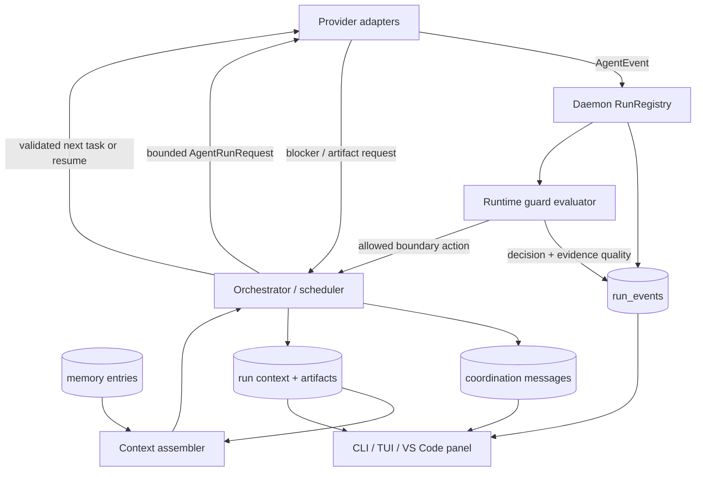
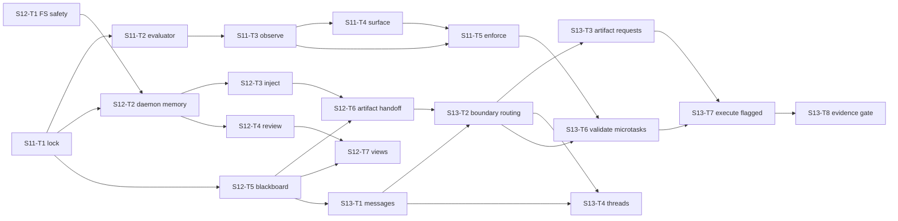

# 16 — Selective Munder Difflin integration plan

**Status:** proposed; review is required before S11-T1 is claimed.
**Bremio snapshot reviewed:** `main` at `c0768ae`, with unrelated local panel
changes left untouched.
**Munder Difflin snapshot reviewed:** upstream `main` at `b91a49fc`
(v0.4.6), fetched 2026-08-29.
**Purpose:** adopt the useful reliability and collaboration mechanisms from
Munder Difflin without embedding its runtime, adding a second orchestrator, or
weakening Bremio's locked control model.

---

## 1. Decision summary

Bremio and Munder Difflin address the same high-level problem — coordinating
several coding agents — but their execution models are different:

- **Bremio** is a deterministic control plane. It creates a validated plan,
  assigns bounded tasks, isolates writes, records evidence, and applies policy
  in code.
- **Munder Difflin** is a persistent desktop agent society. Provider CLIs live
  in PTYs, agents have inboxes and memory, hooks keep them alive, and a GOD
  agent adjudicates the floor.

The integration strategy is therefore **concept porting, not product
composition**:

1. Reimplement the runtime circuit breaker against Bremio's normalized events.
2. Finish Bremio's existing memory path and add a daemon-owned run blackboard.
3. Add bounded, task-scoped collaboration through the orchestrator.
4. Permit dynamic microtasks only behind hard graph limits, a feature flag, and
   net-gain evidence.
5. Defer live agent chat, external triggers, semantic indexing, and a secret
   broker until their prerequisites and threat models exist.

Munder Difflin must not become a runtime dependency, a sidecar orchestrator, or
the owner of a Bremio run.

---

## 2. Verified Bremio baseline

| Area | Current state | Consequence for this plan |
|---|---|---|
| Multi-worker execution | S10-T7 is committed. The router accepts an ordered worker set and the scheduler runs dependency-ready tasks concurrently. | Collaboration can target tasks and roles rather than inventing persistent worker identities. |
| Session lineage | S10-T14 is committed. A fork receives fresh provider bindings. | Session-scoped context must follow Bremio lineage, never provider conversation identity. |
| Adapter lifecycle | `AgentAdapter` exposes `startRun`, `resumeRun`, and `cancelRun`. There is no provider-independent `sendInput` or `steer` seam. | V1 collaboration happens at task boundaries. Live steering is unsupported until proven per adapter. |
| Runtime capability data | Adapters report transport, approval seam, structured tool events, context-metric quality, and cancellation. | Every guard action must be capability-shaped. No generic live-control claim is allowed. |
| Events | `AgentEvent` normalizes started, message, thinking, tool use/result, usage, error, and completion. | The circuit breaker consumes existing events; adapters do not grow provider-specific guard code. |
| Durable authority | The daemon persists ordered, redacted, bounded `run_events` in SQLite and publishes them over resumable SSE. | Guard, context, and collaboration records belong in the daemon, not file mailboxes. |
| Efficiency evidence | Ledger scope distinguishes task, coordination, and run entries. Net gain and calibration use provider-reported data and preserve unknowns. | New coordination work is measurable without inventing prices or quota conversions. |
| Existing cost fallback | Team planning has a pre-task, calibration-gated cost kill-switch. It is inert when cost is incomplete. | The runtime guard is a separate mechanism and must not restart a run after useful work has begun. |
| Memory | `packages/memory` already has scopes, stores, proposal review, provenance, and token-budget injection, but no production consumer. | Extend and connect it; do not create a second memory package. |
| Plan shape | The scheduler executes a validated, static DAG and returns deterministic topological results. | Dynamic expansion needs a separate validator and explicit bounds before it may mutate the runnable graph. |

### 2.1 Existing components to reuse

- `packages/protocol` for wire schemas and additive capability fields.
- `packages/orchestrator` for pure guard decisions, routing, graph validation,
  prompt assembly, and ledger attribution.
- `apps/daemon` for persistence, single-writer authority, enforcement, and
  event publication.
- `packages/memory` for memory domain rules and injection.
- `packages/event-view`, `apps/cli`, and `apps/vscode-extension` for rendering
  the same event vocabulary.
- `packages/policy` for action authorization. A message or guard decision is
  never an alternate route around policy.

### 2.2 Corrections to the initial integration proposal

The initial review correctly recommended selective porting, but four details
must be corrected before implementation:

1. A message table alone is not collaboration. Munder's delivery works because
   persistent PTYs, hooks, stop loops, and wakeups give a live process another
   chance to read its inbox. Bremio has no generic equivalent.
2. A new memory or knowledge package would duplicate `packages/memory` while
   leaving S9-T7 unresolved.
3. A runtime `steer` action cannot be provider-independent until the adapter
   contract exposes a verified interactive-input capability.
4. Dynamic tasks can corrupt the efficiency evidence they are supposed to
   improve unless every expansion is bounded and recorded as coordination.

---

## 3. What is being ported

| Munder mechanism | Bremio adaptation | Priority |
|---|---|---:|
| Circuit-breaker state machine | Pure evaluator over normalized events; observe-only first, opt-in enforcement later | P0 |
| Shared blackboard | Immutable run-context entries in daemon SQLite; derived current snapshot | P0 |
| Markdown-first memory with review | Existing Bremio memory lifecycle backed by the daemon and injected under a token budget | P0 |
| FIPA-lite envelopes | Small task-scoped message vocabulary with idempotency and hop limits | P1 |
| Atomic/single-writer coordination | Daemon transaction + orchestrator authority, not atomic mailbox files | P1 |
| Artifact exchange | Artifact references resolved by the orchestrator into dependent task prompts | P1 |
| Bounded escalation | Named blocker/request outcomes routed by code and policy | P1 |
| Dynamic work creation | Lead proposes; scheduler validates and caps expansion; disabled by default | P2 |
| Conversation/tool waterfall UI | Render from existing events and message records | P2 |
| Scoped integration broker | Revisit after MCP/external-tool consumers and a threat model exist | Later |

## 4. Explicit exclusions

The following are not part of this integration:

- Munder's GOD agent or prompt-owned escalation policy.
- Persistent agent personas, desks, avatars, office simulation, or Pixi/Electron
  frontend.
- Provider PTY ownership inside Bremio.
- Git/file inboxes, outboxes, shared `board.md`, or a second append-only log.
- Direct peer-to-peer worker writes or network calls.
- Provider auto/bypass flags as an enforcement mechanism.
- Semantic/vector memory before a retrieval-quality benchmark proves that
  recency/tags are insufficient.
- Slack, webhook, schedule, or tunnel ingress before authentication,
  authorization, replay protection, and secret handling are designed.
- Munder's pixel assets. Its source is MIT; bundled art has a separate licence.

---

## 5. Architecture decisions

### MD-1 — Bremio remains the only control plane

The lead may propose plans, messages, blockers, and microtasks. Only the
orchestrator/scheduler may validate them, mutate run state, assign work, or
request an adapter action. Provider output is untrusted input.

**Rejected alternatives:**

- Embed Munder's hive and GOD agent: two authorities can disagree about task
  ownership, cancellation, approval, and Git state.
- Run Munder as a sidecar around Bremio: useful as a demo experiment, but it
  duplicates planners, stores, and coordination cost.

### MD-2 — Daemon SQLite is authoritative

Guard decisions, durable memory, run-context entries, messages, and artifact
metadata live beside the rest of Bremio's durable state. The daemon remains the
sole writer and migration owner.

Markdown or JSON may be supported as explicit import/export formats. Repo-local
files are not authoritative because they duplicate across worktrees, pollute a
target repository, and create multi-writer conflict semantics.

### MD-3 — Collaboration is task-boundary first

V1 collaboration is asynchronous and bounded:

1. A worker completes or pauses with a structured blocker/artifact request.
2. The orchestrator validates and persists the request.
3. The scheduler resolves it from known artifacts or creates an approved
   follow-up task.
4. A later `startRun`/`resumeRun` receives the resolved context.

No UI or API may imply live delivery to a running provider process unless that
adapter reports a separately verified interactive-input capability.

### MD-4 — Runtime guard decisions are evidence-only

The guard consumes a signal only when its source is known:

- repeated-tool detection requires structured tool events;
- error storms require provider or adapter error events;
- token velocity requires provider-reported usage, not estimated context;
- no-progress requires a positive progress vocabulary appropriate to the task.

Missing inputs produce `unknown` and are inert. Observe-only is the default.
Hard stop is opt-in and requires confirmed cancellation support.

The existing planning-cost fallback remains separate:

- **Cost fallback:** once, after planning and before worker execution; may switch
  Team to Single.
- **Runtime guard:** during active execution; may warn, suppress future
  coordination, or request cancellation. It never restarts the original prompt
  after workers have begun.

### MD-5 — Memory is reviewed knowledge, blackboard is run evidence

- **Memory** crosses turns/runs and follows the existing proposal-review-
  provenance lifecycle.
- **Run context** is immutable evidence for one run: facts, decisions, blockers,
  open questions, and artifacts.
- **Messages** are delivery records that may reference run-context entries.

These are separate concepts even if all are stored in SQLite.

Project memory is keyed by Bremio's canonical repository identity. Session
memory is transient and follows Bremio session/fork lineage. User memory is
private to the Bremio profile.

### MD-6 — Dynamic expansion is bounded and reversible

The lead may propose a microtask, but the scheduler rejects it unless all of the
following hold:

- no duplicate id and no dependency cycle;
- maximum depth, children per task, and total added tasks remain within config;
- the target adapter and control/workspace modes are valid;
- lead-capacity reserve and quota policy still permit the assignment;
- the originating run is not cancelled, terminal, or guard-constrained;
- the feature flag is enabled.

Every accepted proposal creates an auditable event and coordination ledger
entry. Unknown or non-positive net gain keeps automatic expansion disabled.

### MD-7 — Port behaviour and tests, not product surface

Substantial copied source must retain the MIT copyright and licence notice.
Prefer adapting the state-machine semantics and tests to Bremio's types rather
than vendoring Munder modules. Do not copy pixel assets.

---

## 6. Target data flow



## 7. Proposed contracts

The exact fields are locked in S11-T1/S13-T1; these shapes document the minimum
semantics and prevent an implementation from silently weakening them.

```ts
type EvidenceQuality = reported | observed | unknown;

interface RuntimeGuardDecision {
  runId: string;
  agentId: string;
  level: healthy | warning | constrained | stop-requested;
  action: none | warn | suppress-future-work | cancel;
  reasonCode: string;
  reason: string;
  evidenceQuality: EvidenceQuality;
  observedAt: string;
}

interface RunContextEntry {
  id: string;
  runId: string;
  taskId?: string;
  kind: fact | decision | blocker | open-question | artifact;
  author: { kind: user | orchestrator | agent; id?: string };
  payload: unknown;
  provenance: string;
  createdAt: string;
}

interface CoordinationMessage {
  id: string;
  runId: string;
  conversationId: string;
  fromTaskId: string;
  to: { kind: task | lead | orchestrator; id?: string };
  act: request-artifact | inform | blocker | done;
  replyTo?: string;
  contextEntryIds: string[];
  requiresReply: boolean;
  hopCount: number;
  createdAt: string;
  handledAt?: string;
}
```

Messages address tasks/roles, not provider personas. Payloads receive the same
redaction and size caps as run events.

---

## 8. Package ownership

No new top-level package is justified initially.

| Concern | Owner |
|---|---|
| Schemas and additive wire capability fields | `packages/protocol` |
| Adapter runtime capability declarations | `packages/adapter-sdk` and each adapter |
| Pure guard state machine, graph validation, prompt/context assembly | `packages/orchestrator` |
| Memory domain logic and selection | `packages/memory` |
| Authorization of resulting actions | `packages/policy` |
| SQLite schema, transactions, routes, enforcement, SSE events | `apps/daemon` |
| Shared rendering semantics | `packages/event-view` |
| User surfaces | `apps/cli` and `apps/vscode-extension` |

Create a separate package only when a second runtime consumer exists and the
boundary can be described without depending on daemon or orchestrator internals.

---

## 9. Implementation plan

Every task follows `AGENT-WORKFLOW.md`: claim first, write tests before behaviour
changes, append the sprint log, and finish with
`corepack pnpm release:check`. File lists are expected touch points, not
permission to refactor adjacent code.

### Sprint 11 — Runtime guard

#### S11-T1 — Lock guard and collaboration invariants

**Description:** Promote MD-1 through MD-6 into `docs/15` after review, and lock
the capability vocabulary before code consumes it.

**Acceptance criteria:**

- The doc distinguishes observe, boundary restriction, cancellation, and live
  steering.
- Unknown evidence is explicitly inert.
- The existing planning-cost fallback and the runtime guard cannot be confused.

**Verification:** documentation links resolve; `TASKS.md` and `docs/15` agree.

**Dependencies:** none; requires explicit review of this document.
**Likely files:** `docs/15-architecture-lock.md`, this file.
**Scope:** S.

#### S11-T2 — Build the pure runtime-guard evaluator

**Description:** Add a provider-agnostic state machine that consumes normalized
observations and returns decisions without performing side effects.

**Acceptance criteria:**

- Repeated tools, error storms, reported token velocity, recovery, and
  compaction/no-progress false positives have focused tests.
- One observation advances at most one level and healthy observations recover
  one level at a time.
- Missing or estimated inputs cannot trigger a numeric threshold.

**Verification:** focused unit tests plus `corepack pnpm release:check`.

**Dependencies:** S11-T1.
**Likely files:** `packages/protocol/src/*`,
`packages/orchestrator/src/runtime-guard.ts` and its test.
**Scope:** M.

#### S11-T3 — Persist observe-only guard decisions

**Description:** Feed task events into the evaluator in the daemon and append a
named run event whenever guard state changes. No execution behaviour changes.

**Acceptance criteria:**

- Store-then-publish ordering and SSE replay preserve each decision once.
- A daemon restart never claims to have recovered in-memory guard counters.
- Event payloads are redacted, capped, and carry the reason/evidence quality.

**Verification:** daemon storage/protocol tests, restart test, release check.

**Dependencies:** S11-T2.
**Likely files:** `apps/daemon/src/runs.ts`, `storage.ts`, daemon tests,
`packages/protocol`.
**Scope:** M.

#### S11-T4 — Surface guard state and reasons

**Description:** Render the same guard event in CLI/TUI and the panel, including
the unavailable-signal reason rather than showing unknown as healthy.

**Acceptance criteria:**

- Current level, action, reason, evidence quality, and update time are visible.
- Observe-only state is labelled and cannot look like enforced protection.
- CLI and panel render from one canonical event interpretation.

**Verification:** renderer drift tests, CLI/panel tests, release check.

**Dependencies:** S11-T3.
**Likely files:** `packages/event-view`, `apps/cli`,
`apps/vscode-extension`.
**Scope:** M.

#### S11-T5 — Enforce opt-in boundary actions

**Description:** Add disabled-by-default enforcement. Constrained runs may stop
receiving retries/escalations/new tasks at a meaningful boundary; hard stop may
request cancellation only where the adapter declares and proves support.

**Acceptance criteria:**

- The default configuration is observe-only.
- No completed work is restarted and no fallback silently changes flow mode.
- Cancellation is surfaced and remains coherent in run events, reports, and
  ledger entries.

**Verification:** boundary/cancellation integration tests and release check.

**Dependencies:** S11-T3, S11-T4.
**Likely files:** `config/routing.yaml`, `packages/orchestrator`,
`apps/daemon` and tests.
**Scope:** M.

### Sprint 12 — Reviewed memory and run blackboard

#### S12-T1 — Reject transient scope in `FsMemoryStore`

**Description:** Close S9-T8 by refusing a session-scoped write in a persistent
filesystem store instead of placing an unreadable record at the store root.

**Acceptance criteria:**

- The invalid write fails before touching disk.
- Project and user scopes retain existing behaviour.

**Verification:** focused memory tests and release check.

**Dependencies:** none.
**Likely files:** `packages/memory/src/fs-store.ts` and its tests.
**Scope:** S.

#### S12-T2 — Add daemon-backed durable memory

**Description:** Make daemon SQLite authoritative for project/user memory while
keeping session memory transient and fork-safe.

**Acceptance criteria:**

- Project entries use canonical repository identity; user entries are profile
  private.
- Provenance, review status, expiry, and visibility round-trip without defaults.
- Migration and API tests cover restart and repository worktree identity.

**Verification:** storage/route/client tests and release check.

**Dependencies:** S11-T1, S12-T1.
**Likely files:** `apps/daemon/src/storage.ts`, `server.ts`,
`packages/daemon-client`, `packages/memory` and tests.
**Scope:** M.

#### S12-T3 — Inject approved memory into a real run

**Description:** Close S9-T7 by selecting approved memory under a token budget
and attaching it to lead and worker requests through the existing context
assembly path.

**Acceptance criteria:**

- An approved project fact reaches the next applicable lead/worker prompt.
- Pending/rejected/expired entries never reach a provider.
- Empty or unavailable memory degrades to no injection, never run failure.

**Verification:** prompt-capture integration tests for Single and Team, release
check.

**Dependencies:** S12-T2.
**Likely files:** `packages/harness`, `packages/orchestrator`,
`apps/daemon` and tests.
**Scope:** M.

#### S12-T4 — Expose proposal review end to end

**Description:** Let users list, accept, and reject memory proposals without
inventing provenance on acceptance.

**Acceptance criteria:**

- Accept requires an explicit target source, matching
  `MemoryProposalLifecycle`.
- Concurrent/duplicate reviews have a deterministic first-result contract.
- Audit data names reviewer, decision, time, and optional note.

**Verification:** route/client/CLI or panel tests and release check.

**Dependencies:** S12-T2.
**Likely files:** `apps/daemon`, `packages/daemon-client`, one user surface,
tests.
**Scope:** M.

#### S12-T5 — Add immutable run-context entries

**Description:** Persist facts, decisions, blockers, questions, and artifact
metadata as append-only run evidence and derive a current blackboard snapshot.

**Acceptance criteria:**

- The daemon is the only writer and allocation is transactional.
- Entries are attributable to user/orchestrator/agent and cannot be silently
  overwritten.
- A session fork does not inherit post-fork run context.

**Verification:** schema, concurrency, replay, and fork-lineage tests; release
check.

**Dependencies:** S11-T1.
**Likely files:** `packages/protocol`, `apps/daemon/src/storage.ts`,
`runs.ts` and tests.
**Scope:** M.

#### S12-T6 — Hand artifacts to dependent tasks

**Description:** Resolve artifact references from completed dependencies and
include only the selected, bounded context in the next task prompt.

**Acceptance criteria:**

- Missing artifacts produce a named blocker rather than guessed content.
- Provenance identifies producing run/task/agent and content location.
- Context-budget overflow is reported and deterministic.

**Verification:** two-task Team integration test, cancellation test, release
check.

**Dependencies:** S12-T3, S12-T5.
**Likely files:** `packages/orchestrator/src/scheduler.ts`,
`packages/harness`, `apps/daemon` and tests.
**Scope:** M.

#### S12-T7 — Show memory, context, and artifacts

**Description:** Add read-only views over the same daemon records; do not create
client-side shadow state.

**Acceptance criteria:**

- The panel and CLI name scope, provenance, review state, and source task.
- Stale/unavailable data is explicit.
- Large artifact bodies are not loaded into a list response by default.

**Verification:** client contract and UI tests, release check.

**Dependencies:** S12-T4, S12-T5.
**Likely files:** `packages/daemon-client`, `apps/cli`,
`apps/vscode-extension` and tests.
**Scope:** M.

### Sprint 13 — Bounded collaboration and optional expansion

**Gate before claiming:** Sprint 12 must pass and the tech lead must explicitly
approve this sprint. The useful P0 integration is already delivered by S11 and
S12; S13 must justify its added coordination cost.

#### S13-T1 — Define task-scoped messages

**Description:** Add the minimum message envelope from section 7 and persist it
transactionally with unique ids.

**Acceptance criteria:**

- Messages address tasks/lead/orchestrator, never a durable provider persona.
- Hop count, reply linkage, handled state, redaction, and payload caps are
  enforced in code.
- Duplicate delivery is idempotent.

**Verification:** protocol/storage/property tests and release check.

**Dependencies:** S12-T5.
**Likely files:** `packages/protocol`, `apps/daemon/src/storage.ts` and tests.
**Scope:** M.

#### S13-T2 — Route messages at task boundaries

**Description:** Let the scheduler drain validated requests after a task settles
and make the response available to a later start/resume.

**Acceptance criteria:**

- No direct peer side effect exists.
- Only request-artifact and blocker require a response in V1; inform/done are
  terminal.
- Hop/message budgets stop ping-pong with a named escalation.

**Verification:** multi-worker integration, retry/idempotency, cancellation,
release check.

**Dependencies:** S12-T6, S13-T1.
**Likely files:** `packages/orchestrator`, `apps/daemon` and tests.
**Scope:** M.

#### S13-T3 — Resolve artifact requests

**Description:** Satisfy a request from the run artifact index or turn it into a
named unresolved blocker; never scrape another worker's worktree implicitly.

**Acceptance criteria:**

- Only policy-approved, bounded artifacts are returned.
- Unknown artifact/request ownership is fail-closed.
- Request and response coordination costs are attributed.

**Verification:** two-worker end-to-end test and release check.

**Dependencies:** S13-T2.
**Likely files:** `packages/orchestrator`, `apps/daemon`, ledger tests.
**Scope:** M.

#### S13-T4 — Add conversation threads to the user surfaces

**Description:** Render task conversations and blockers without presenting them
as a general-purpose agent chat system.

**Acceptance criteria:**

- Threads show run/task ownership, act, reply linkage, and terminal state.
- Observe/cancel states remain coherent when one task stops.
- CLI and panel read the daemon record instead of synthesizing threads.

**Verification:** client/UI tests and release check.

**Dependencies:** S13-T1, S13-T2.
**Likely files:** `packages/daemon-client`, `apps/cli`,
`apps/vscode-extension`.
**Scope:** M.

#### S13-T5 — Probe live-input capabilities

**Description:** Record whether each current provider can safely receive
additional input during an in-flight run, how delivery is acknowledged, and how
it composes with cancellation/resume.

**Acceptance criteria:**

- Results come from real provider surfaces or recorded fixtures, not inference.
- Unsupported remains the default.
- No live-input implementation task is created for an unverified adapter.

**Verification:** provider notes and reproducible fixtures/commands.

**Dependencies:** S11-T1.
**Likely files:** `docs/04-adapters.md`, test fixtures if available.
**Scope:** S.

#### S13-T6 — Validate dynamic microtask proposals

**Description:** Add a pure validator for proposed graph expansion. This task
does not execute the added work.

**Acceptance criteria:**

- Duplicate ids, cycles, excess depth/children/total, invalid dependencies,
  invalid modes, exhausted reserve, and guard-constrained runs are rejected.
- Validation output names every blocker.
- Default limits are conservative and configuration is validated.

**Verification:** table/property tests and release check.

**Dependencies:** S11-T5, S13-T2; requires the Sprint 13 approval gate.
**Likely files:** `packages/protocol`, `packages/orchestrator`,
`config/routing.yaml` and tests.
**Scope:** M.

#### S13-T7 — Execute microtasks behind a feature flag

**Description:** Apply accepted proposals only at scheduler boundaries and
record their lifecycle without making automatic expansion the default.

**Acceptance criteria:**

- Feature flag defaults off.
- Accepted tasks retain worktree isolation, deterministic result ordering, and
  ordinary policy/capability checks.
- Every proposal, refusal, execution, retry, and handoff is recorded as
  coordination evidence.

**Verification:** bounded-DAG integration, restart/cancel tests, release check.

**Dependencies:** S13-T3, S13-T6.
**Likely files:** `packages/orchestrator/src/scheduler.ts`, `apps/daemon`,
ledger/report code and tests.
**Scope:** M.

#### S13-T8 — Gate promotion on paired evidence

**Description:** Extend stats/compare so bounded collaboration and dynamic
expansion can be evaluated against the best Single baseline before becoming a
recommended default.

**Acceptance criteria:**

- Unknown cost/outcome remains unknown with a named blocker.
- Non-positive net gain keeps automatic expansion disabled.
- Promotion requires every existing calibration threshold plus a configured
  minimum of eligible collaboration samples.

**Verification:** calibration/stats/compare tests and release check.

**Dependencies:** S13-T7.
**Likely files:** `packages/orchestrator/src/calibration.ts`,
`net-gain.ts`, `apps/cli/src/stats.ts` and tests.
**Scope:** M.

---

## 10. Dependency graph



S11-T2 and S12-T1 may proceed independently after S11-T1 is approved. Schema
or migration tasks sharing `apps/daemon/src/storage.ts` remain sequential.

---

## 11. Sprint gates

### Sprint 11 gate

- Guard state is visible but observe-only by default.
- Unknown usage, unstructured tool streams, and unsupported cancellation never
  trigger action.
- Opt-in boundary enforcement does not restart or silently change an active
  run.
- Full release gate passes.

### Sprint 12 gate

- An approved project fact reaches a later Single and Team prompt under budget.
- A pending/rejected proposal never reaches a provider.
- Two tasks exchange one artifact through daemon-owned context.
- Fork lineage and canonical repository identity are covered.
- Full release gate passes.

### Sprint 13 gate

- Two workers exchange one request/reply through the orchestrator with hop and
  idempotency guards.
- No peer writes, unbounded broadcast, or unsupported live-steering claim exists.
- Dynamic expansion remains off unless explicitly enabled.
- Its coordination cost appears in paired net-gain evidence; unknown/non-
  positive evidence cannot promote it.
- Full release gate passes.

---

## 12. Risks and mitigations

| Risk | Impact | Mitigation / stop condition |
|---|---|---|
| False no-progress trips on read-only or external work | Good runs are restricted | Require task-appropriate positive evidence and debounce; observe-only first |
| Usage events are incremental while an imported algorithm expects cumulative counters | False token velocity | Normalize once at the evaluator boundary and test both shapes; never mix them |
| Adapter ignores cancellation | Bremio reports a stop while work continues | Reuse `ProcessSupervisor` confirmation and capability-gate hard stop |
| Message store becomes dead data | UI shows collaboration that no worker receives | Task-boundary vertical slice must pass before thread UI |
| Dynamic DAG grows without bound | Quota and latency explosion | Hard caps, feature flag, guard state, quota reserve, and calibration gate |
| Memory leaks across repositories or forks | Context/data integrity failure | Canonical repository key, session lineage tests, explicit scopes |
| Duplicate durable stores | Split-brain history | Daemon SQLite only; files are import/export |
| Copied Munder code/assets create licence obligations | Distribution risk | Port semantics/tests; preserve MIT notice for copied code; exclude assets |
| Munder security documentation has drifted from its newer integrations | Unsafe feature imitation | Treat source as evidence and threat-model any external ingress separately |

---

## 13. Deferred decisions and revisit points

| Item | Revisit when |
|---|---|
| Live mid-run messages | At least one adapter has a verified, acknowledged interactive-input seam and cancellation composition |
| Separate `packages/collaboration` | A second non-daemon consumer needs the same domain logic |
| Semantic/vector memory | Retrieval benchmarks show tags/recency miss useful approved knowledge often enough to justify it |
| Scoped integration secret broker | A real MCP/external integration is wired end to end and has a threat model |
| Schedules, webhooks, Slack/GitHub ingestion | Auth, replay protection, rate limits, repository authorization, and kill controls are designed |
| Persistent agent identities | Evidence shows task/role addressing cannot express a real workflow |
| Office/avatar UI | Not planned; it does not improve Bremio's measured orchestration outcome |

---

## 14. External evidence and verification boundary

Primary Munder references:

- Repository and architecture:
  <https://github.com/chaitanyagiri/munder-difflin>
- Hive protocol:
  <https://github.com/chaitanyagiri/munder-difflin/blob/main/HIVE.md>
- Circuit breaker:
  <https://github.com/chaitanyagiri/munder-difflin/blob/main/src/main/breaker.ts>
- Scoped integration broker:
  <https://github.com/chaitanyagiri/munder-difflin/blob/main/src/main/integrationBroker.ts>
- Security statement:
  <https://github.com/chaitanyagiri/munder-difflin/blob/main/SECURITY.md>
- Source licence:
  <https://github.com/chaitanyagiri/munder-difflin/blob/main/LICENSE>

Local verification against the pre-existing v0.4.5 clone:

- `npm run typecheck` passed.
- `npm run test:focused` ran 552 tests: 541 passed, 9 failed, 2 skipped.
- Failures included Windows path/socket assumptions, installer behaviour,
  transcript-directory resolution, and a capacity-handler case.

Those results are not claimed for upstream v0.4.6. They justify treating Munder
as an active reference implementation rather than vendoring it without a
Bremio-specific safety and portability review.
